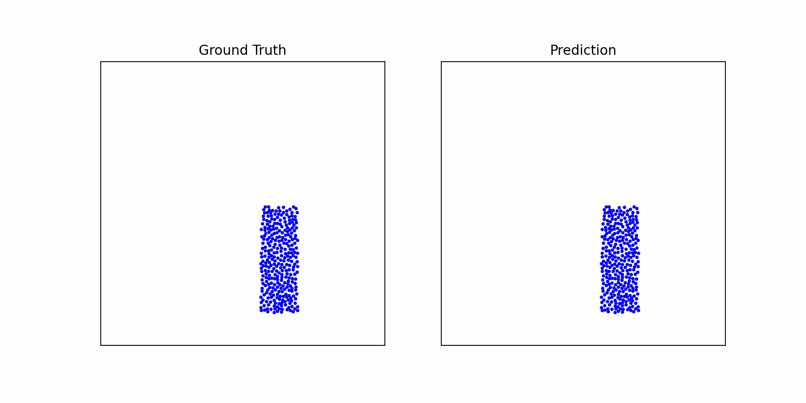

# Fluid Minds: Learning to Simulate Physics

<p align="center">
  
</p>
<p align="center"><em>An example of water-drop particles simulated using an Interaction Network.</em></p>

This repository provides a PyTorch-based framework for learning to simulate particle-based physics using Graph Neural Networks (GNNs). The approach draws inspiration from the seminal work, [Learning to Simulate Complex Physics with Graph Networks](https://arxiv.org/abs/2002.09405) (Sanchez-Gonzalez et al., ICML 2020) and builds upon the [Learn-to-Simulate](https://github.com/Emiyalzn/Learn-to-Simulate/tree/main) project.

---

## Table of Contents

1. [Overview](#overview)
2. [Key Features](#key-features)
3. [Installation](#installation)
4. [Dataset](#dataset)
5. [Usage](#usage)
   - [Training](#training)
   - [Evaluation](#evaluation)
   - [Rollout Generation](#rollout-trajectory-generation)
   - [Train-Eval-Rollout](#train-eval-rollout)
6. [Key Parameters](#key-parameters)
7. [Directory Structure](#directory-structure)
8. [Notes](#notes)
9. [Acknowledgments](#acknowledgments)
10. [Contact](#contact)

---

## Overview

This project explores **particle-based physics** simulation using graph networks to learn how particles interact over time. Each particle is treated as a node in a graph, and edges represent local interactions (e.g., collisions, forces, or fluid interactions). By repeatedly applying a GNN “processor,” we can predict how a system evolves through time.

**Why Graph Networks?**  
- Physics is often local and pairwise (e.g., collisions, springs, fluid or rigid interactions).  
- GNNs excel at representing and learning from relational data structures.

We support a variety of particle systems, including:
- **Water drops**
- **Sand dynamics**
- **Goop behavior**

---

## Key Features

- **Multiple GNN Architectures**  
  Choose among **Interaction Networks**, **GAT (Graph Attention Networks)**, or **GCNs** for message passing.
- **Single-Step and Rollout Predictions**  
  - **Single-Step**: Predict the system state one timestep ahead.  
  - **Rollout**: Recursively feed model outputs back as inputs to simulate for many timesteps.
- **Support for Different Particle Types**  
  Model mixtures of fluid, rigid, boundary, and other particle categories.
- **Noise Injection for Robustness**  
  Add noise to training data for better generalization.
- **Checkpoint Saving and Loading**  
  Automatic saving of “best” models based on validation metrics.
- **Validation During Training**  
  Monitor progress and stop early if there is no improvement.

---

## Installation

1. Clone the repository:
```bash
git clone https://github.com/Elder453/CPSC483-final.git
cd CPSC483-final
```

2. Install dependencies:
```bash
conda env create -f environment.yml
conda activate learn-to-sim
```
  **Note**: CUDA-specific versions of PyTorch and TensorFlow may need to be installed manually depending on your system’s GPU and CUDA version. Refer to the [PyTorch installation guide](https://pytorch.org/get-started/locally/) and [TensorFlow](https://www.tensorflow.org/install) installation guide for details.

3. Create necessary directories:
```bash
mkdir -p ./datasets
mkdir -p ./models
mkdir -p ./rollouts
```

## Dataset

We provide shell scripts to automatically download datasets. For example, to download a small “WaterDropSample” dataset:
```bash
bash ./download_dataset.sh WaterDropSample ./datasets
```
This populates `./datasets/WaterDropSample` with `train/`, `valid`/`, and `test/` splits.


## Usage

### Training

Train a model with default parameters:
```bash
bash ./train.sh
```
Inside the `train.sh` script, you can adjust arguments (e.g., `--dataset`, `--gnn_type`, `--num_steps`, etc.). By default, it trains an **interaction network** using a **one-step loss function**.


### Evaluation

Evaluate model predictions:
```bash
bash ./eval.sh
```
- Computes single-step metrics (position and acceleration MSE).
- If enabled, computes full rollout metrics like multi-step MSE and Earth Mover’s Distance.

### Rollout (Trajectory) Generation

Generate and animate full trajectory rollouts:
```bash
bash ./rollout.sh
```
- Produces .pkl files capturing predicted rollouts. 
- Then, renders them as GIF animations (like the one shown above) in `./rollouts`.

### Train-Eval-Rollout

Alternatively, to train a model, evaluate it on a held-out test set, and generate and animate the full trajectory:
```bash
bash ./train_eval_render.sh
```
- This is simply a concatenation of the aforementioned files!

## Key Parameters

Below are some commonly adjusted parameters:

- `--mode`: Training or evaluation mode (`train`, `eval`, `eval_rollout`)
- `--dataset`: Name of dataset to use
- `--batch_size`: Number of samples per batch
- `--num_steps`: Number of training steps
- `--message_passing_steps`: Number of GNN message passing steps
- `--gnn_type`: Type of GNN to use (`interaction_net`, `gcn`, `gat`)
- `--noise_std`: Standard deviation of noise injection
- `--lr`: Learning rate

Additional parameters can be found in the `main.py` code or by reading the provided `train.sh`, `eval.sh`, and `rollout.sh` scripts.

## Directory Structure

Below is a simplified directory layout:
```
/CPSC483-final/
├── datasets/                  # Dataset storage
│   └── WaterDropSample/
│       ├── train/
│       ├── valid/
│       └── test/
├── models/                    # Saved model checkpoints
│   └── WaterDropSample/
├── rollouts/                  # Generated rollouts and GIFs
│   └── WaterDropSample/
│       └── interaction_network/
│           └── one_step/
│               └── ex0.gif    # (Sample animation)
├── src/                       # Source code
│   ├── main.py                # Entry point (train/eval)
│   ├── dataloader.py
│   ├── graph_network.py
│   ├── learned_simulator.py
│   ├── message_passing.py
│   ├── models.py
│   ├── render_rollout.py
│   ├── rollout.py
│   ├── utils_connectivity.py
│   ├── utils_eval.py
│   ├── utils_noise.py
│   └── utils.py
├── environment.yml
├── transform_to_pkl.py
├── download_dataset.sh
├── train.sh
├── eval.sh
├── rollout.sh
└── README.md
```

## Notes

- This project was developed using Yale's Grace high-performance computing cluster. Thus, the code assumes `CUDA 12.4` availability. For CPU-only usage, modify device settings and `environment.yml` accordingly.
- Training time varies based on dataset size and computational resources.
- Best validation checkpoints are automatically saved during training.
- Parameters may need adjustment based on your specific use case.

## Acknowledgments

This implementation directly extends:

- DeepMind’s Original **TensorFlow** Code: [Learning to Simulate Complex Physics with Graph Networks](https://github.com/google-deepmind/deepmind-research/tree/master/learning_to_simulate)
- **PyTorch** project by [Emiyalzn/Learn-to-Simulate](https://github.com/Emiyalzn/Learn-to-Simulate/tree/main)


```shell
@article
{DBLP:journals/corr/abs-2002-09405,
  author    = {Alvaro Sanchez{-}Gonzalez and
               Jonathan Godwin and
               Tobias Pfaff and
               Rex Ying and
               Jure Leskovec and
               Peter W. Battaglia},
  title     = {Learning to Simulate Complex Physics with Graph Networks},
  journal   = {CoRR},
  volume    = {abs/2002.09405},
  year      = {2020},
  url       = {https://arxiv.org/abs/2002.09405},
  eprinttype = {arXiv},
  eprint    = {2002.09405},
  timestamp = {Mon, 02 Mar 2020 16:46:06 +0100},
  biburl    = {https://dblp.org/rec/journals/corr/abs-2002-09405.bib},
  bibsource = {dblp computer science bibliography, https://dblp.org}
}
```

We are grateful to the authors for open-sourcing their research and hope our research may be extended similarly!

---

## Contact

For any questions, suggestions, or contributions, please reach out to:

- **Elder Veliz**  
  Email: [elder.veliz@yale.edu](mailto:elder.veliz@yale.edu)  
  GitHub: [github.com/elder453](https://github.com/Elder453)

- **Teo Dimov**  
  Email: [teo.dimov@yale.edu](mailto:teo.dimov@yale.edu)  
  GitHub: [github.com/teodimov](https://github.com/teodimov)

Alternatively, you can open an issue on the [GitHub repository](https://github.com/Elder453/CPSC483-final) for any inquiries or to report bugs.
